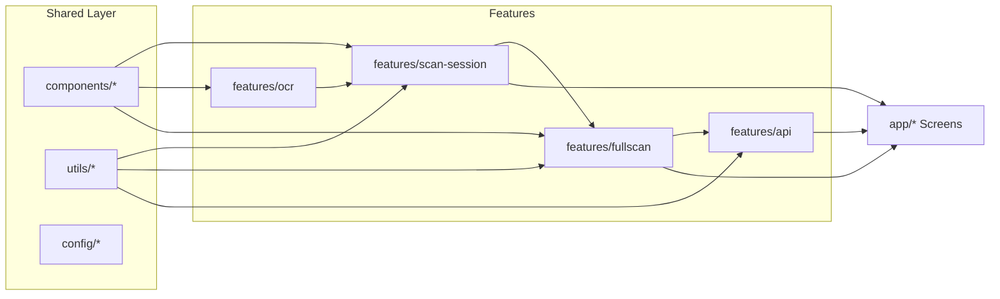

## Ziel

Die Scan-/OCR-/Fullscan-Strecke soll übersichtlicher, wartbarer und mehr in Richtung Bulletproof-React-Architektur gebracht werden. Fokus: Entflechtung der großen Screens, klarere Domänen-Modelle, saubere Trennung zwischen UI, Domain und API/Excel.

## Ist-Situation (kurz)

- `ParaLensApp/app/scan-review.tsx` und `ParaLensApp/app/(tabs)/history.tsx` sind sehr große, monolithische Dateien mit gemischten Verantwortlichkeiten (UI, Form-Logik, Mapping, Statusberechnung).
- `ParaLensApp/components/UiScannerCamera.tsx` ist ebenfalls groß, übernimmt Kamera, OCR-Handling, Aggregation und Debug-UI in einem.
- OCR ist relativ gut gekapselt in `[ParaLensApp/features/ocr](ParaLensApp/features/ocr)`, aber die Weiterverarbeitung (Mapping → Form → FullScan → API/Excel) ist stark verstreut.
- Naming und Datenstrukturen sind inkonsistent (`subMenuValues` vs `subMenusValues`, verschiedene Shapes für Werte), es gibt viele Magic-Strings für `box_id`s.

## Grobe Zielarchitektur

- **Shared** (z.B. `components`, `config`, `utils`) ist unabhängig und wird von allen Features und `app` genutzt.
- **Features** kapseln Domänenlogik: `ocr`, `scan-session`, `fullscan`, `api`.
- **app** (Expo Router Screens) konsumiert Features, definiert aber möglichst wenig Logik.

## Konkrete Refaktoringschritte

### 1. Neues Feature `scan-session` einführen

- **Ordnerstruktur**:
  - `[ParaLensApp/features/scan-session/components](ParaLensApp/features/scan-session/components)`
  - `[ParaLensApp/features/scan-session/hooks](ParaLensApp/features/scan-session/hooks)`
  - `[ParaLensApp/features/scan-session/mappers](ParaLensApp/features/scan-session/mappers)`
  - `[ParaLensApp/features/scan-session/types](ParaLensApp/features/scan-session/types)`
  - `[ParaLensApp/features/scan-session/utils](ParaLensApp/features/scan-session/utils)`
- **Domänentypen definieren** in `scan-session/types`:
  - `ScanFormValue` (z.B. `{ value: string; unit?: string }`).
  - `ScanFormState` für Injection/Dosing/Holding/Cylinder mit einheitlicher Struktur.
  - Typen für Scrollbar-Form (`IndexValuePair[]` + Units), klar getrennt von OCR-Types.
- **Mapping-Layer** einziehen:
  - `ocr-to-form-mapper.ts`: `OcrSnapshot` + Kontext (Section, Modus) → `ScanFormState`.
  - `form-to-domain-mapper.ts`: `ScanFormState` → `FullScan`-Section-Daten (domänenseitig).
- **Hook für Sitzungs-Logik**:
  - `useScanSession` / `useScanFormState` in `hooks`: Kapselt Form-State und Mapping, Screens konsumieren nur diesen Hook.

### 2. `scan-review.tsx` aufteilen und vereinfachen

- Ausgangsdatei: `[ParaLensApp/app/scan-review.tsx](ParaLensApp/app/scan-review.tsx)` (763 Zeilen).
- Aufteilung in:
  - `features/scan-session/components/ScanReviewScreen.tsx`: Präsentations-Komponente (UI, Form-Controls), erhält Form-State und Callbacks via Props/Hook.
  - `features/scan-session/hooks/useScanReview.ts`: Kapselt komplette Logik für:
    - Laden/Empfangen von `OcrSnapshot` (später Kontext statt URL-Params).
    - Aufruf von `ocr-to-form-mapper`.
    - Verwaltung von `ScanFormState`.
    - Trigger von `saveSection` in Fullscan-Context.
  - `features/scan-session/utils/scrollbar-utils.ts`: Gemeinsame Logik wie `buildRowsFromScrollbar`, `extractScrollbarUnits`, `extractNumberStrings`.
- `app/scan-review.tsx` wird danach stark vereinfacht:
  - Importiert `ScanReviewScreen` und den Hook.
  - Kümmert sich hauptsächlich um Routing/Navigation.

### 3. URL-Parameter-Nutzung für OCR-Snapshot entschärfen

- Aktuell wird der komplette `OcrSnapshot` als JSON in URL-Params von `camera` → `scan-review` geschoben.
- Ziel: OCR-Snapshot über Context oder zentralen Store halten, z.B.:
  - `features/scan-session/scan-session-context.tsx` (ähnlich wie `fullscan-context`).
  - `camera` schreibt OCR-Ergebnis in den Context, `scan-review` liest aus dem Context.
- Plan:
  - Schritt 1: Einen schlanken Context definieren (`currentSnapshot`, `setCurrentSnapshot`).
  - Schritt 2: `camera`-Tab so umbauen, dass es nur eine ID oder Flag via Route übergibt, nicht den ganzen Snapshot.

### 4. `features/fullscan` strukturieren und Excel-Export entflechten

- Ausgangspunkt: `[ParaLensApp/features/fullscan/excel-export.ts](ParaLensApp/features/fullscan/excel-export.ts)` (563 Zeilen).
- Neue Struktur:
  - `features/fullscan/excel/excel-export-service.ts`: High-Level-API, z.B. `exportFullScanToExcel(fullScan: FullScanDto, options)`, ruft Mapper + Builder.
  - `features/fullscan/excel/mappers/fullscan-to-excel.ts`: Reines Mapping von `FullScanDto` auf tabellarische Struktur (Rows/Columns, Werte, Units).
  - `features/fullscan/excel/builders/excel-builder.ts`: Baut mit `xlsx` das eigentliche Workbook/Buffer.
- **Vereinheitlichung der Section-Daten in `types.ts**`:
  - Ein `ScanSectionData`-Typ, der für alle Sectionen (`injection`, `dosing`, `holdingPressure`, `cylinderHeating`) gleiche Strukturen nutzt (z.B. `mainMenu`, `subMenus`, Meta-Infos).
- `history`-Tab nutzt dann nur noch die öffentliche API von `excel-export-service` statt direkten Zugriff auf Mapping-Details.

### 5. `features/api` aufräumen und Mapper einführen

- **Doppelte Services** beseitigen:
  - Klar entscheiden, ob `injection-service.ts` oder `injectionService.ts` der gültige Name ist, und alle doppelten Dateien zusammenführen.
- **Mapper-Layer für API**:
  - Neuer Ordner `[ParaLensApp/features/api/mappers](ParaLensApp/features/api/mappers)`.
  - Datei `domain-to-api-mapper.ts` mit Funktionen:
    - `mapFullScanToCreateRequest(scan: FullScanDto): CreateFullScanRequest`.
    - Evtl. einzelne Mapper pro Section.
- `scanUploadService.ts` verschlanken:
  - Service ruft nur noch Mapper + `httpClient` auf.
  - Keine direkte Feldlogik (`subMenuValues` vs `subMenusValues`, Units) mehr im Service.

### 6. Magic-Strings und Naming vereinheitlichen

- `**box_id`-Konstanten**:
  - Neue Datei `features/ocr/constants/box-id-constants.ts`.
  - Definiert Konstanten für alle relevanten `box_id`s (z.B. `INJECTION_SPRAY_PRESSURE_LIMIT_BOX_ID`).
  - `scan-review.tsx`/`scan-session`-Mapper nutzen nur noch diese Konstanten, kein Plain-String.
- **Section-Feld-Namen harmonisieren**:
  - In `fullscan/types.ts` und API-DTOs konsistenten Wortschatz definieren:
    - z.B. überall `subMenuValues` statt Mischung aus `subMenusValues`/`dosingSpeedsValues`.
  - Mapping-Layer anpassen, damit UI/Domain klare Typen nutzen, API-Mapping kümmert sich nur um Format.

### 7. Kamera/OCR-Komponente gezielt entschlacken

- `components/UiScannerCamera.tsx` bleibt grundsätzlich in `components`, bekommt aber klarere Schnittstellen:
  - Props: `onScanComplete(ocrSnapshot: OcrSnapshot)` und evtl. `onDebugInfo`.
  - Interne Debug-UI in eigenen Subkomponenten/Feature-Flags auslagern.
- Aggregationslogik verbleibt in `features/ocr` (Hooks + Utils), `UiScannerCamera` ruft nur die öffentliche API.

### 8. Tests & Typ-Sicherheit verbessern (optional, aber empfohlen)

- Für die neuen Mapper (`ocr-to-form`, `form-to-domain`, `domain-to-api`, `fullscan-to-excel`) gezielte Unit-Tests anlegen.
- Strenger auf Typen achten:
  - Unterschied zwischen Domain-Modell (`FullScanDto`), API-DTO (`CreateFullScanRequest`) und Storage-Modell (`FullScanRecord`) explizit machen.

## Fokus-Reihenfolge für die Umsetzung

1. **scan-review-Entflechtung + neues Feature `scan-session**` (bringt am meisten Übersicht, direkt spürbar im Alltag).
2. **API-Mapping entflechten (`scanUploadService` + `api/mappers`)**.
3. **Excel-Export trennen und `fullscan`-Typen vereinheitlichen**.
4. **Kamera-/OCR-Komponente leicht entschlacken und auf saubere Props/Events bringen**.
5. **Naming/Magic-Strings und kleinere Konsistenz-Themen (box-IDs, section-Feldnamen)**.

Diese Schritte können iterativ umgesetzt werden; nach jedem Schritt sollte die App weiter lauffähig bleiben, da jeweils nur eine Schicht gezielt verändert wird.